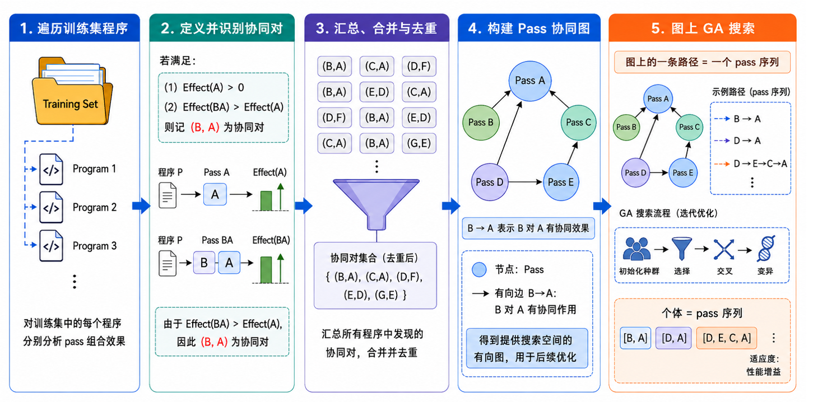

# RuyiTuner

基于优化协同效应分析的 LLVM 调优工具，自动挖掘优化间的协同效应，搜索代码体积/性能最优的优化序列。

## 项目简介

RuyiTuner 是一款基于优化协同效应分析的 LLVM 编译优化调优工具，在目标架构的 LLVM IR 上自动搜索能够最大化缩减代码体积/提升性能的优化序列。与固定的传统优化流水线（如 -O3/-Oz）不同，RuyiTuner 通过实际运行数据、挖掘优化"协同效应"，找出一些优化组合——这些组合所产生的优化效果优于各优化单独作用之和，并以这些协同对为搜索空间、基于遗传算法搜索最优的优化序列。



工作流程在实现上可以分为两个阶段：

1. **训练阶段** (train.py): 首先根据所用 LLVM 工具链版本自动生成匹配的 Pass 列表——从 `opt --print-passes` 读取注册表，剔除观察/调试类、插桩类以及会清空整个模块的 `internalize` 等无益 Pass，并对每个候选 Pass 进行运行与输出可解析性双重验证；随后对数据集中的每个 .ll 文件逐一测试所有单 Pass 与 Pass 对组合，找出"组合效果严格优于单 Pass"的协同对，输出 Step1/Step2 两级 CSV 供优化阶段使用。

2. **优化阶段** (run.py): 以训练得到的协同对为有向图搜索空间，基于遗传算法搜索最优 Pass 序列；适应度定义为相对指定优化等级基线（`--opt-level`，默认 Oz）的指令数缩减比例 `(基线指令数 - 优化后指令数) / 基线指令数`，最终输出每个文件的最优 Pass 序列、代码缩减率与当前整体平均缩减率。

**版本与架构无关**：RuyiTuner 不绑定特定 LLVM 版本或目标架构,目标架构完全由 .ll 文件内嵌的 target triple 决定，天然支持 x86、RISC-V 及混合架构数据集（datasets/x86 与 datasets/riscv 均由 clang 从 C++ 源码生成）。

## 环境要求

- Python 3.7+，依赖 pandas（安装：`pip install pandas`）
- LLVM 工具链
  - RuyiTuner 对 LLVM 版本没有硬性要求，较新版本的 LLVM 工具链均可使用，只需搭配与该版本匹配的 pass 列表（可手动构建，或由 train.py 自动生成，详见使用方法）。
  - 不同构建之间的区别仅在于指令计数方式：使用 `-DLLVM_FORCE_ENABLE_STATS=ON`（或 `-DLLVM_ENABLE_ASSERTIONS=ON`）构建的 opt 可通过 `opt -passes=instcount -stats` 进行指令计数；使用未启用统计（如默认 Release）构建的 opt 时，RuyiTuner 会自动回退为对 IR 文本的统计。两种方式计数结果基本一致，互不影响正确性。
  - RuyiTuner 输入文件为 LLVM IR（`--input_type ll`）：仅需 opt，无需其他工具；输入文件为 C 源码（`--input_type c`）：还需同一工具链中的 clang（`ninja clang`），用于先将 .c 文件编译为 .ll 再走后续训练与优化流程。计数方式使用 `--count_mode obj-size`（统计 .o 文件 .text 段字节大小）：还需同一工具链中的 llc 与 llvm-size（`ninja llc llvm-size`）。
- 环境变量（可选）：opt 执行失败时默认静默处理（自动回退为原始 IR 计数），设置 `RUYITUNER_SHOW_OPT_FAILURES=1` 可恢复逐条失败信息输出，便于排查崩溃的 pass 组合。生成 pass 列表时被剔除 pass 的具体清单与原因默认不打印（仅输出剔除数量），设置 `RUYITUNER_SHOW_EXCLUDED_PASSES=1` 可恢复逐条输出，便于排查被剔除的 pass。

## 项目结构

```
├── datasets/            # 测试数据集 (.ll IR 与 C 源码)
│   ├── x86/             # x86架构数据集
│   │   ├── 1_x_ll/      #   LLVM IR: clang从C++源码生成(含main+scanf/printf), 内嵌x86_64 target triple
│   │   └── c_files/     #   C源码: CSiBE v2.1.1基准测试套件(供--input_type c使用)
│   └── riscv/           # RISC-V架构数据集: 交叉clang从C++源码生成, 内嵌riscv64 target triple+datalayout
├── output/              # 训练输出结果
│   ├── Step1_FindSynerPairs.csv       # 发现的协同Pass对(已过滤空结果)
│   ├── Step2_EnumeratedPairs.csv      # 枚举的所有协同对
├── passes_examples/    # pass列表的一些示例文件
│   ├── passes_21.1.8.txt              # 手动筛选的LLVM 21.1.8版本的pass列表
│   ├── passes_22.1.0.txt              # 手动筛选的LLVM 22.1.0版本的pass列表
│   ├── passes_2118-gen.txt            # 自动生成的LLVM 21.1.8版本的pass列表
│   ├── passes_2210-gen.txt            # 自动生成的LLVM 22.1.0版本的pass列表
├── ruyituner.py         # 一键入口：依次执行训练(train.py)与优化(run.py)
├── CHANGELOG.md         # 版本变更记录
├── scripts/             # 主要执行脚本
│   ├── train.py         # 训练脚本：发现协同Pass对（含pass列表自动生成）
│   ├── run.py           # 运行脚本：基于协同对使用GA优化代码
│   └── utils/           # 工具模块
│       ├── GA.py        # 遗传算法实现
│       ├── PassSyner.py # Pass协同效应分析
│       └── common.py    # 公共工具函数
├── Readme.md            # 项目说明文档
```

## 详细说明

### 1. 一键完成训练与优化（ruyituner.py）

ruyituner.py 是对 train.py 和 run.py 的封装，一次调用即可依次完成训练与GA优化两个阶段。输入为数据集目录与 LLVM 工具链路径，输入文件类型由 `--input_type` 指定（ll=LLVM IR；c=C 源码，先用工具链中的 clang 生成 .ll 到临时缓存目录再走后续流程，结束后自动清理）；训练阶段输出协同 Pass 对 CSV（Step1/Step2），优化阶段输出每个文件的最优 Pass 序列与得分。全流程可由 ruyituner.py 一键完成，也支持单独训练（train.py）或单独优化（run.py）

**使用演示：**

```bash
# 完整流程：训练 → 用训练得到的协同Pass对做GA优化
python3 ruyituner.py \
    --dataset ./datasets/x86 \
    --input_type ll \
    --llvm_tools_path /llvm_dir/build/bin

# 仅训练，不优化
python3 ruyituner.py \
    --dataset ./datasets/x86 \
    --input_type ll \
    --llvm_tools_path /llvm_dir/build/bin \
    --only_train

# 仅优化（复用已有的Step2_EnumeratedPairs.csv）
python3 ruyituner.py \
    --dataset ./datasets/x86 \
    --input_type ll \
    --llvm_tools_path /llvm_dir/build/bin \
    --only_run \
    --paircsv ./output/Step2_EnumeratedPairs.csv

# 输入为C源码：先用clang生成.ll到临时缓存目录，训练+优化结束后自动清理；用 .o 文件的text部分大小作为评分口径（要求工具链同时包含opt与llc）;旧式C代码（K&R/C89，如CSiBE的compiler基准）需用--c_std指定C标准，否则隐式函数声明导致编译失败；依赖自定义编译宏的基准（如flex需-DHAVE_CONFIG_H，否则flexdef.h不包含标准头）可用--c_flags追加参数
python3 ruyituner.py \
    --dataset ./datasets/x86/c_files/csibe-v2.1.1/flex-2.5.31 \
    --input_type c \
    --llvm_tools_path /llvm_dir/build/bin \
    --count_mode obj-size \
    --c_std gnu89 \
    --c_flags '-DHAVE_CONFIG_H'
```

**参数说明：**
- `--dataset`: 数据集目录（必选，训练与优化共用）
- `--input_type`: 输入文件类型 ll/c（必选）；ll=LLVM IR，走原有训练+优化路径；c=C 源码，先用clang（优先`--llvm_tools_path`下的clang，回退系统PATH）以`-O0 -S -emit-llvm -Xclang -disable-O0-optnone`把数据集目录下所有.c文件编译为.ll（保持相对目录结构、并行编译），生成的.ll放入临时缓存目录并作为数据集走后续训练+优化，结束后自动清理；编译失败的.c文件告警跳过，全部失败则报错退出
- `--c_std`: (可选) 传给clang的C语言标准（如gnu89），仅`--input_type c`时生效；不提供时不传`-std`参数；旧式C代码（K&R/C89）需要它，否则clang会因隐式函数声明报错
- `--c_flags`: (可选) 传给clang的额外编译参数（如`-DHAVE_CONFIG_H`，支持空格分隔多个），仅`--input_type c`时生效；不提供时不传；依赖autoconf生成头文件的基准（如flex）需要它；值以-开头时`--c_flags=-DHAVE_CONFIG_H`与`--c_flags '-DHAVE_CONFIG_H'`两种写法均可
- `--llvm_tools_path`: LLVM工具链路径，包含opt（必选）
- `--output_dir`: (可选) 训练输出目录，默认项目根目录下的output/，自动创建
- `--passfile`: (可选) 训练用的pass列表文件；不提供时由train.py自动生成（默认不写文件）
- `--paircsv`: (可选) 优化用的协同对CSV，默认`<output_dir>/Step2_EnumeratedPairs.csv`
- `--num_workers`: (可选) 训练并行线程数，默认16
- `--opt-level`: (可选) GA基线评分的优化等级O0/O1/O2/O3/Os/Oz，默认Oz（透传给run.py）
- `--count_mode`: (可选) 指令计数方式开关 auto/opt-stats/text/obj-size，默认auto（透传给train.py与run.py）
- `--passlist_output`/`--no_parse_check`/`--keep_instrumentation`/`--extra_exclude`: (可选) 透传给train.py的pass列表生成参数
- `--only_train`/`--only_run`: (可选) 仅执行训练/仅执行优化，两者不能同时使用

### 2. 训练阶段：生成pass列表并发现协同Pass对

训练需要一份与所使用LLVM版本匹配的pass列表（passes_XXXX.txt），可以手动选择构建，也可以由train.py自动生成；自动生成的pass列表会检查输出IR是否可以被opt重新解析，剔除不可用的pass，避免在训练和优化阶段出现问题。可自主添加LLVM Pass到passes_XXXX.txt文件中以及训练文件到datasets文件夹中作为补充。训练脚本会分析指定数据集中的 .ll 文件，识别具有协同效应的Pass组合，并生成两个阶段的CSV文件。

**协同对的发现过程：** 对数据集中的每个 .ll 文件分别执行以下两步：

- **单 Pass 筛选**：把候选 pass 列表中的每个 pass 单独作用于该文件（`opt -passes=<pass>`）并统计指令数；凡是比原始 IR 指令数更少的 pass，进入"有效 pass"集合；
- **两两配对**：对每个有效 pass 作为序列后段 B，与全部候选 pass 依次组成两段序列 `[A, B]`（A 在前、B 在后）运行并统计指令数；若 `[A, B]` 的指令数比 B 单独运行时更少（即加入 A 能带来额外收益），则把 `(A, B)` 记为协同对。

所有文件找到的协同对汇总去重后，分别写入 Step1（按文件保存协同对列表）与 Step2（枚举全部唯一协同对，供优化阶段的 GA 使用）。

**使用演示：**

```bash
mkdir -p output
cd scripts

# 手动指定pass列表进行训练（--output_dir也可省略，默认使用项目根目录下的output/）
python3 train.py \
    --dataset ../datasets/x86 \
    --llvm_tools_path ../llvm_dir/build/bin \
    --output_dir ../output \
    --passfile ../passes_examples/passes_2210-gen.txt

# 不提供--passfile，自动生成与LLVM版本匹配的pass列表后进行训练（--output_dir也可省略,默认使用项目根目录下的output/；pass列表默认不写文件，除非指定--passlist_output）
python3 train.py \
    --dataset ../datasets/x86 \
    --llvm_tools_path ../llvm_dir/build/bin \
    --output_dir ../output

# 仅生成pass列表，不训练
python3 train.py \
    --gen_passlist_only \
    --llvm_tools_path ../llvm_dir/build/bin \
    --passlist_output ../passes_XXXX.txt
```

**参数说明：**
- `--dataset`: 包含 .ll 文件的数据集目录（必选）
- `--llvm_tools_path`: LLVM工具链路径，包含opt（必选）
- `--output_dir`: (可选) 输出结果保存目录；未指定时自动创建并使用项目根目录下的output目录
- `--passfile`: (可选) LLVM Pass列表文件；不提供时自动生成与LLVM版本匹配的pass列表（默认不写文件）
- `--gen_passlist_only`: (可选) 仅生成pass列表并退出，不训练；该模式下--dataset/--output_dir可不提供
- `--passlist_output`: (可选) 指定时把自动生成的pass列表写入该文件；仅生成模式(--gen_passlist_only)未指定时默认写passes_<LLVM版本号>.txt
- `--no_parse_check`: (可选) 跳过输出IR的opt解析检查
- `--keep_instrumentation`: (可选) 保留插桩类pass（asan/tsan/pgo-*等，默认剔除）
- `--extra_exclude`: (可选) 额外的pass排除规则（正则表达式）
- `--num_workers`: (可选) 并行工作线程数，默认16
- `--count_mode`: (可选) 指令计数方式开关 auto/opt-stats/text/obj-size，默认auto

**输出文件：**
- `Step1_FindSynerPairs.csv`: 发现的协同Pass对（写入时已过滤掉空列表行）
- `Step2_EnumeratedPairs.csv`: 枚举所有协同对的最终结果

### 3. 优化阶段：使用GA优化代码

优化阶段使用训练得到的协同Pass对，通过遗传算法(GA)搜索最优的Pass序列。

**遗传算法简介：** GA 模拟自然选择过程——把一条 Pass 序列当作"个体"，其适应度是该序列对代码体积的缩减程度；算法维护一个种群，每代通过选择(保留高适应度个体)、交叉(交换两条序列的片段)、变异(随机扩展序列)产生新种群，迭代若干代后输出最优个体。RuyiTuner 的默认参数为：种群规模 100、迭代 10 代、变异率 0.5、每代保留前 10% 精英个体。

**整体优化过程：** 以 Step2 中的协同对为有向边构建搜索图（节点是 Pass，边表示"先 A 后 B"的协同关系）；初始种群在图中随机游走生成长度不超过 2 的序列，之后通过多代交叉与变异不断进化。每个个体都会被真正执行一遍（`opt -passes=<序列>`）并按指令数打分。对数据集中的每个 .ll 文件独立运行一次 GA，输出该文件的最优 Pass 序列与得分。

**评分标准：** 先计算基线——用 `--opt-level` 指定的优化等级（默认 Oz）直接优化该文件得到的指令数（`--count_mode obj-size` 下为 .o 文件的 .text 段字节大小）；每个文件的 Code Size Reduction Rate = (基线 - GA序列优化后) / 基线。Code Size Reduction Rate 为正表示 GA 序列比基线更短（有效改进，例如 10% 表示再少 10%）；为 0 表示与基线持平；最优个体为负时不输出（负值与比基线更差的路径没有意义，按无收益记 0%）；为 100% 属于异常（模块被清空，通常是 internalize 类 pass 导致）。Mean Reduction Rate 是所有文件按大小加权汇总的整体平均缩减率：

$$\text{Mean Reduction Rate} = \frac{\sum\text{所有文件基线} - \sum\text{所有文件优化后}}{\sum\text{所有文件基线}}$$

Code Size Reduction Rate 为 0 的文件同样计入分母、分子贡献为 0，因此会拉低 Mean Reduction Rate；基线越大的文件在 Mean Reduction Rate 中的权重越大。

**使用演示：**

```bash
cd scripts
python3 run.py \
    --dataset ../datasets/x86 \
    --llvm_tools_path ../llvm_dir/build/bin \
    --paircsv ../output/Step2_EnumeratedPairs.csv
```

**参数说明：**
- `--dataset`: 待优化的 .ll 文件或包含 .ll 文件的目录
- `--llvm_tools_path`: LLVM工具链路径
- `--paircsv`: 训练阶段生成的协同Pass对CSV文件
- `--opt-level`: (可选) GA基线评分的优化等级O0/O1/O2/O3/Os/Oz，默认Oz
- `--count_mode`: (可选) 指令计数方式开关 auto/opt-stats/text/obj-size，默认auto

**输出：**
- 输出用于优化的Pass序列
- 打印该序列下的 Code Size Reduction Rate
- 输出所有文件加权汇总的 Mean Reduction Rate

**输出示例：**

```text
Current File: datasets/x86/1_24.ll
Path:  ['module(declare-runtime-libcalls)', 'module(scc-oz-module-inliner)', 'cgscc(attributor-cgscc)', 'function(memcpyopt)', 'module(iroutliner)', 'function(dce)', 'function(gvn)', 'function(gvn-hoist)']
Code Size Reduction Rate:  1.54%
Mean Reduction Rate:  6.03%
```


### 4. 指令计数方式（--count_mode）

train.py、run.py 与 ruyituner.py 均支持 `--count_mode` 参数（可选，默认 `auto`），控制训练与优化阶段用哪种口径统计代码大小：

- `auto`（默认）：优先使用 `opt -passes=instcount -stats`（需 LLVM_FORCE_ENABLE_STATS=ON 构建），不可用时自动回退为 IR 文本指令行统计；
- `opt-stats`：强制使用 `opt -passes=instcount -stats`，opt 不存在、不支持 -stats 或统计失败时直接报错退出；
- `text`：强制按 IR 文本缩进规律统计指令行数；
- `obj-size`：用工具链中的 llc 把 IR 编译为 .o 目标文件，再用 llvm-size 解析并返回其中 .text 段的字节大小作为代码大小指标（不含符号表/重定位等 ELF 结构开销，更贴近实际代码体积）。

四种口径下训练与评分逻辑不变（协同对发现与 GA 评分公式相同），只是"指令数"的度量来源不同；`obj-size` 模式要求 `--llvm_tools_path` 下同时存在 opt、llc 与 llvm-size（构建时执行 `ninja llc llvm-size`）。工具链缺失时直接报错；个别 IR 无法被 llc 汇编时（如 RISC-V 上的 pseudo-probe），按 opt 崩溃的同一策略回退统计原始 IR（该序列视为无收益）。

## 注意事项

- 小数据集上 `-Os` 与 `-Oz` 的基线结果可能完全相同（GA 得分无差异）；要体现优化等级之间的差别并获得更丰富的协同对，建议使用更大的真实程序生成的 .ll 文件；
- `ruyituner.py` 的 `--input_type c` 要求数据集的 .c 文件能被 clang 独立编译（CSiBE 中 linux 内核等依赖构建系统的 .c 文件会被跳过并告警）；生成的 .ll 临时缓存目录在流程结束（含提前退出）后自动清理；
- 数据集中的 .ll 文件需内嵌 `target triple`，且不要带 `optnone` 属性（生成时加 `-Xclang -disable-O0-optnone`）；否则 opt 会跳过全部 pass，导致单 Pass 不生效、训练找不到协同对；
- 在x86环境下，训练/优化 RISC-V 数据集时，把 `--dataset` 指向 `datasets/riscv`，并搭配面向 RISC-V 的交叉编译工具链（即默认目标为 riscv64 的 LLVM 构建），使 pass 列表与基线评分都按 RISC-V 语义执行。

## 参考文献

- Haolin Pan, Yuanyu Wei, Mingjie Xing, Yanjun Wu, and Chen Zhao. 2025. Towards Efficient Compiler Auto-tuning: Leveraging Synergistic Search Spaces. In Proceedings of the 23rd ACM/IEEE International Symposium on Code Generation and Optimization (CGO '25). Association for Computing Machinery, New York, NY, USA, 614–627. https://doi.org/10.1145/3696443.3708961

## 贡献者

RuyiTuner V1.0由潘浩林、董津沅开发完成。

RuyiTuner V1.x 由史宁宁开发。

## 版本

版本变更记录见 [CHANGELOG.md](./CHANGELOG.md)。新增版本条目时，请追加到该文件末尾的最新版本段中。
